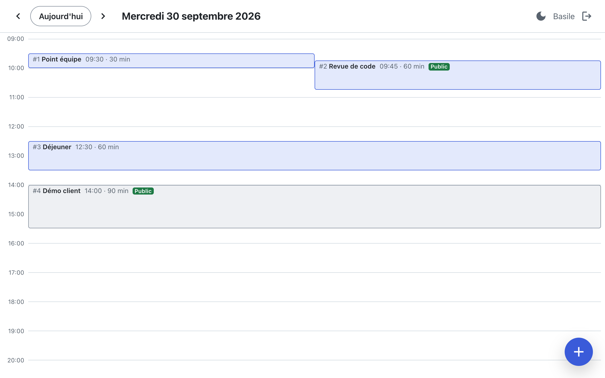
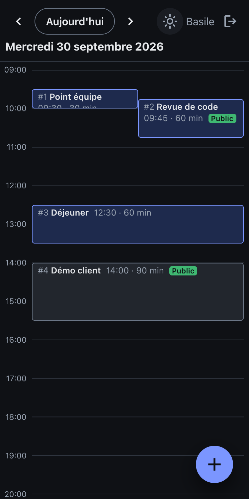

# Agenda — React 19

Vue « jour » d'un agenda : un calendrier écrit **from scratch** en React 19, qui affiche, crée,
modifie et supprime des événements, et répartit la largeur entre ceux qui se chevauchent.

- **Démo** : _à venir_ (Cloudflare Workers)
- **Comptes de démo** : `basile` / `demo1234`
- **Backend** : API Spring Boot du dépôt [Basile-V/agenda](https://github.com/Basile-V/agenda)
  (dossier `Backend/`), hébergée sur Render

> ⏳ Le backend est en offre gratuite et se met en veille : la première requête peut prendre
> jusqu'à quelques minutes. L'application l'indique pendant le réveil.



<details>
<summary>Sur mobile, en thème sombre</summary>



</details>

## En bref

- **Zéro dépendance UI.** En production : `react`, `react-dom` et `react-router`, rien d'autre.
  Le calendrier, les modales, les onglets et le client HTTP sont écrits à la main.
- **React 19 là où il apporte quelque chose** : `useOptimistic`, `useActionState`,
  `useFormStatus`, `use()`, `ref` en prop, `<title>` rendu dans les pages,
  `useSyncExternalStore`.
- **Accessible** : HTML sémantique, `<dialog>` natif, navigation clavier complète, focus
  restitué, contrastes AA vérifiés dans les deux thèmes.
- **Testé** : 227 tests (Vitest, Testing Library, MSW), dont les règles du kata vérifiées par
  des assertions dédiées. TypeScript `strict`, ESLint avec règles typées.

C'est la réécriture en React d'un front Angular existant (même backend, mêmes fonctionnalités).
Le front Angular a servi de référence fonctionnelle, pas de modèle d'architecture.

## Fonctionnalités

- **Connexion et inscription** sur `/login` (deux onglets). Session par cookies httpOnly (JWT),
  restaurée au chargement ; après connexion, retour à la page demandée.
- **Vue jour** sur `/:date` (`YYYY-MM-DD`) : jour précédent, suivant, aujourd'hui. La date vit
  uniquement dans l'URL, et chaque jour a donc un lien partageable.
- **Grille 09:00 → 21:00** : position et hauteur proportionnelles à l'heure et à la durée,
  recalculées quand la grille change de taille (`ResizeObserver`).
- **Chevauchements** répartis selon les règles du kata (voir [plus bas](#algorithme-de-chevauchement)).
- **Création, détails, modification, suppression** dans des modales `<dialog>`. Les
  changements s'affichent tout de suite et reviennent en arrière si le serveur les refuse, avec un
  message qui explique pourquoi.
- **Événements publics et privés** : on voit les siens et les événements publics des autres,
  en lecture seule.
- **Réveil du serveur** : message statique dans `index.html` avant le démarrage de React, puis
  une modale d'attente pour toute requête qui dépasse 2 s (jamais pour une réponse rapide).
- **Thème clair ou sombre** au choix, mémorisé, appliqué avant le premier affichage.
- **Mobile** : la mise en page s'adapte aux petits écrans.

## Choix techniques

### Pas de librairie, par principe et par contrainte

Le kata limite les dépendances à ce qu'exige le framework. Chaque besoin passe donc d'abord par
la plateforme :

| Besoin | Solution |
|---|---|
| Modales, focus piégé, Échap, fond inerte | `<dialog>` + `showModal()` |
| Sélection de date et d'heure | `<input type="date">`, `<input type="time">` |
| Validation des formulaires | Contraintes natives (`required`, `min`, `pattern`) + `checkValidity()`, messages en français |
| Formatage des dates | `Intl.DateTimeFormat` |
| Requêtes HTTP | `fetch` + `AbortController` |
| Mesure de la grille | `ResizeObserver` |
| Thème | Variables CSS redéfinies sous `[data-theme='dark']` |

### React 19

- **`useOptimistic`** pour les trois mutations. Le changement optimiste et le changement
  confirmé passent par la même fonction pure, [`applyEventChange`](src/features/calendar/eventChanges.ts) :
  un événement déplacé sur un autre jour quitte la grille, dans les deux cas.
- **`useActionState` + `<form action>` + `useFormStatus`** pour la connexion et l'inscription :
  erreurs par champ et état d'envoi sans `useState` à la main.
- **`useSyncExternalStore`** pour le compteur de requêtes lentes : il vit dans le client HTTP,
  hors de React, et un hook d'une ligne le lit. Aucun provider.
- **`use(AuthContext)`**, `<AuthContext value>`, **`ref` en prop** (pas de `forwardRef`),
  **callbacks `ref` avec nettoyage** (ouverture des modales, `ResizeObserver`), **`<title>`**
  rendu dans les pages.

Deux pièges évités, testés et documentés dans [CLAUDE.md](CLAUDE.md) :

- **Transitions regroupées.** Tant qu'une action asynchrone est en cours, React regroupe toutes
  les transitions. Par défaut, React Router passe ses navigations en transition : une création
  envoyée au serveur endormi aurait bloqué le changement de jour pendant une minute. Les
  navigations restent donc immédiates (`useTransitions={false}`, nos routes n'ont pas de loader).
  Pour la même raison, le formulaire d'événement utilise `onSubmit` et non `<form action>`.
- **Pas de flash de l'ancien jour.** `useDayEvents` ne remet pas son état à zéro dans un effet :
  chaque réponse sait à quelle date elle correspond, et l'état « chargement » est calculé pendant
  le rendu. Une réponse en retard ne peut pas s'afficher sur le mauvais jour.

### Client HTTP

[`apiFetch`](src/api/client.ts) est la seule fonction qui appelle `fetch` :

- cookies envoyés (`credentials: 'include'`), jeton CSRF (double-submit) sur les requêtes mutantes ;
- sur un 401 : **un seul** refresh de session partagé entre les requêtes simultanées, puis on
  rejoue la requête ; si le refresh échoue, retour à la connexion (sauf serveur injoignable) ;
- sur un 403 avec un jeton CSRF renouvelé entre-temps : une seule nouvelle tentative ;
- erreurs typées (`ApiError`) avec des messages lisibles : les messages techniques du serveur
  ne sont jamais affichés tels quels ;
- chaque réponse est **validée** avant d'être typée, sans conversion forcée (`as`).

### Même origine en production, grâce à un proxy

Le front (Cloudflare) et l'API (Render) sont sur deux domaines différents. Appelée directement,
l'API poserait trois problèmes : CORS, des cookies de session **tiers** (bloqués par Safari et
de plus en plus de navigateurs), et un cookie CSRF que le JavaScript du front ne peut pas lire.

Le Worker qui sert le site relaie donc `/backend/*` vers Render
([`worker/index.ts`](worker/index.ts), testé). Pour le navigateur, tout est sur le même domaine :
pas de CORS, des cookies du site, un jeton CSRF lisible. Aucune modification du backend n'a été
nécessaire.

Pourquoi `/backend` et pas `/api` : EasyPrivacy, activée par défaut dans uBlock Origin, contient
la règle `||workers.dev/api/event`, qui bloquait `GET /api/events` chez les visiteurs équipés d'un
bloqueur. Le Worker retire le préfixe avant de transmettre, et réécrit le chemin des cookies
limités à un chemin du backend (`refresh_token`, `Path=/api/auth` → `/backend/api/auth`) pour
que le navigateur les renvoie.

## Algorithme de chevauchement

Règles du kata (LargeurMax = largeur du conteneur) :

1. si A et B se chevauchent, Largeur(A) = Largeur(B) ;
2. LargeurMax = largeur de la fenêtre ;
3. si A et B se chevauchent sur une plage, Largeur(A) + Largeur(B) = LargeurMax.

[`layoutEvents`](src/features/calendar/layout.ts) est une fonction pure, en une seule passe :

1. **Tri** par heure de début, puis durée décroissante.
2. **Groupes** : les événements qui se chevauchent, directement ou de proche en proche, forment
   un groupe. Un groupe se termine quand un événement commence après la fin de tous les autres.
3. **Colonnes** : chaque événement prend la première colonne libérée, sinon une nouvelle. Pour
   des intervalles triés par début, cette méthode gloutonne utilise le minimum de colonnes.
4. **Largeur** : tous les événements d'un groupe ont la même largeur, `LargeurMax / colonnes`.

```
        colonne 1   colonne 2
09:00  ┌─────────┐
       │    A    │ ┌─────────┐
10:00  │         │ │    B    │   A et B se chevauchent : même groupe,
       └─────────┘ │         │   chacun la moitié de la largeur
                   └─────────┘
11:00  ┌─────────────────────┐
       │          C          │   C commence quand B finit : pas de
12:00  └─────────────────────┘   chevauchement, nouveau groupe, pleine largeur
```

Deux choix assumés, différents du front Angular :

- **Pas d'extension sur les colonnes libres.** Élargir un événement là où il reste de la place
  donnerait des largeurs différentes à deux événements qui se chevauchent : règle 1 violée.
- **Pas de marge à déduire.** La colonne des heures est placée à côté de la zone des
  événements (CSS grid) et seule cette zone est mesurée : LargeurMax est exactement la largeur
  mesurée, rien ne déborde.

Limite mathématique : avec trois événements simultanés, les règles 1 et 3 ne peuvent pas tenir
ensemble (trois moitiés ne tiennent pas côte à côte). La règle 1 prime, chacun prend un tiers,
et un test le documente. La règle 3 est garantie pour tout groupe à deux colonnes.

## Architecture

Organisation **par fonctionnalité** :

```
src/
  main.tsx, App.tsx, router.tsx
  api/          apiFetch (cookies, CSRF, refresh, requêtes lentes) + fonctions typées + types
  features/
    auth/       AuthProvider, useAuth, RequireAuth, LoginPage, LoginForm, RegisterForm
    calendar/   DayPage, CalendarHeader, DayGrid, EventBlock, EventFormDialog,
                EventDetailsDialog, useDayEvents, layout.ts, time.ts, eventChanges.ts
    loading/    useIsWaitingForServer, ServerWakeOverlay
  ui/           Button, IconButton, Dialog, TextField, Tabs, Spinner, ThemeToggle, icons
  styles/       variables CSS, reset
  test/         faux backend MSW, helpers de rendu, ResizeObserver de test
worker/         proxy Cloudflare : /backend/* relayé vers le backend (même origine)
```

- `ui/` ne connaît ni l'API ni le domaine ; `api/` ne dépend pas de React.
- La logique métier (`layout.ts`, `time.ts`, `eventChanges.ts`) est faite de fonctions pures,
  écrites en TDD.
- Seul l'utilisateur courant est en Context. Les événements du jour vivent dans
  `useDayEvents(date)`, au plus près de leur usage.

## Lancer le projet

Prérequis : Node.js 22 ou plus récent, npm.

```bash
npm install
npm run dev:mock        # http://localhost:5173, sans backend
```

En mode mock, les requêtes sont interceptées dans le navigateur par MSW, avec le même faux
backend que les tests (sessions, CSRF, visibilité). Se connecter avec `basile` / `demo1234`.

### Avec le backend en local

1. Lancer le backend du dépôt [agenda](https://github.com/Basile-V/agenda) (`Backend/`), qui
   écoute sur `http://localhost:8080`.
2. `cp .env.example .env` (`VITE_API_BASE_URL=http://localhost:8080`).
3. `npm run dev -- --port 4200` : le port autorisé par la configuration CORS actuelle du backend.

### Scripts

| Commande | Rôle |
|---|---|
| `npm run dev` | Serveur de développement Vite |
| `npm run dev:mock` | Idem, avec l'API simulée par MSW |
| `npm run build` | Vérification TypeScript + build de production dans `dist/` |
| `npm run preview` | Sert le build de production en local |
| `npm test` | Tests Vitest |
| `npm run lint` | ESLint |
| `npm run format` | Prettier |

### Variables d'environnement

| Variable | Rôle | Valeur |
|---|---|---|
| `VITE_API_BASE_URL` | URL de base de l'API | `.env` en dev (`http://localhost:8080`) ; `/backend` dans `.env.production` : l'API est appelée sur le domaine du site, via le proxy |
| `API_ORIGIN` | Backend vers lequel le Worker relaie `/backend/*` | `https://agenda-o5su.onrender.com` (`vars` de `wrangler.json`) |

## Tests

```bash
npm test
```

- **Logique pure** : `layout.ts` (événement seul, chevauchements, événements contigus,
  horaires hors plage, indépendance de l'ordre, les 3 règles du kata sur plusieurs scénarios et
  plusieurs largeurs), `time.ts` (changements de mois, d'année, années bissextiles, changement
  d'heure), `eventChanges.ts`.
- **Client API** avec MSW : cookies, en-tête CSRF, refresh unique pour des 401 simultanés,
  nouvelle tentative sur 403, validation des réponses, requêtes lentes (faux timers).
- **Parcours utilisateur** avec Testing Library, sur le vrai routeur et les vrais providers :
  connexion, inscription, navigation, création, modification (même jour et changement de jour),
  suppression, lecture seule, erreurs serveur et retour arrière, clavier et focus.

Les tests interrogent l'interface comme un utilisateur (rôles et noms accessibles), sans
simuler `fetch` ni les modules internes : seul le réseau est intercepté, par MSW.

## Déploiement

Cloudflare Workers, configuré dans [`wrangler.json`](wrangler.json) :

- les fichiers de `dist/` sont servis directement, et toute route de l'application renvoie
  `index.html` (`not_found_handling: "single-page-application"`, sans fichier `_redirects`, qui
  entrerait en conflit) ;
- `/backend/*` passe d'abord par le Worker (`run_worker_first`), qui relaie vers le backend.

```bash
npm run build
npx wrangler dev --local-protocol https   # le build + le proxy, sur https://localhost:8787
npx wrangler deploy
```

## Licence

Projet personnel de démonstration.
